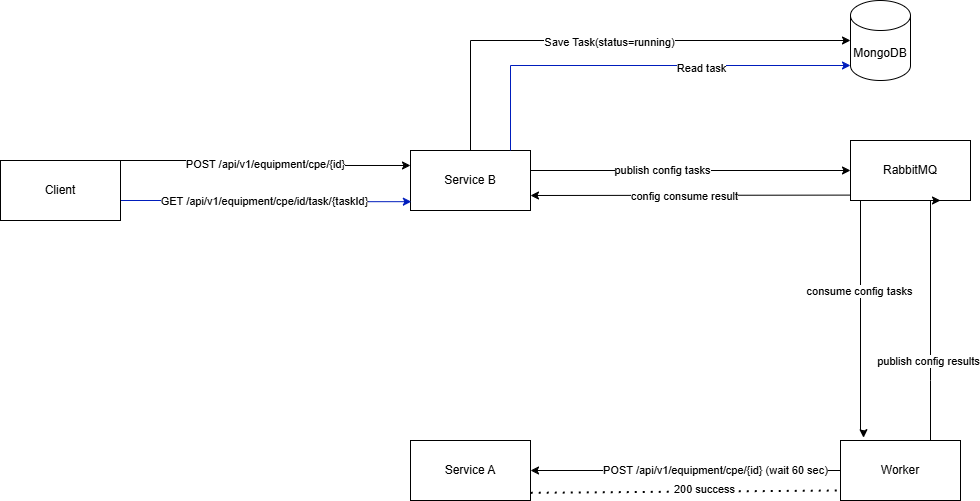
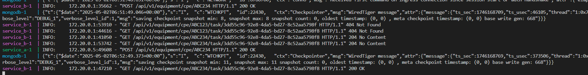
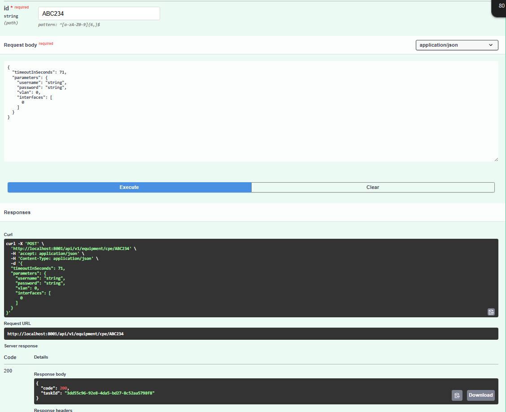
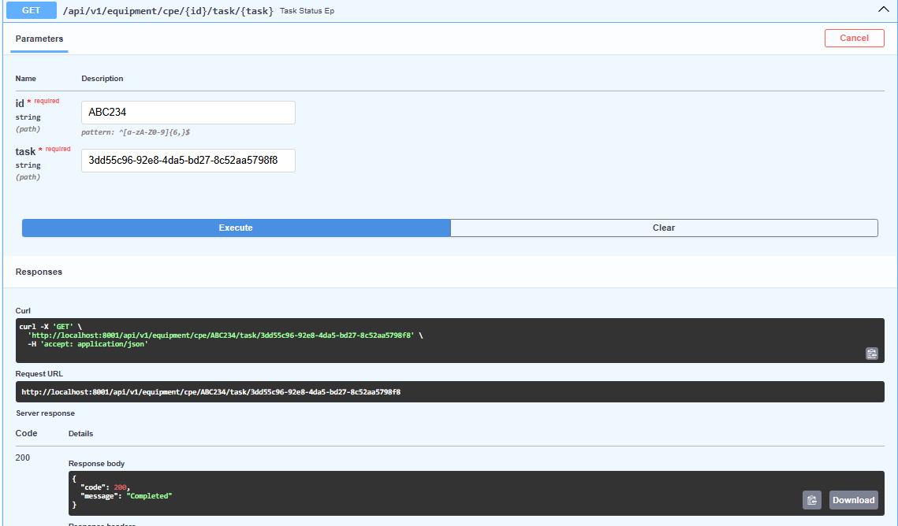
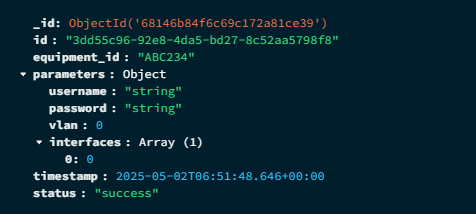

# Asynchronous CPE Provisioning System

  

Два микросервиса + воркер + MongoDB + RabbitMQ для надёжного асинхронного запуска задач конфигурации сетевого оборудования.

Форматер: black

Линтер: flake8

## Архитектура

[](docs/Architecture.png)

---

## Описание

- **Service A**  
  HTTP-служба-заглушка для внешнего провайдера конфигурации.  
  `POST /api/v1/equipment/cpe/{id}` -> ждёт ровно 60 с -> возвращает `{ code:200, message:"success" }`.

- **Service B**  
  HTTP-менеджер задач:
  1. `POST /api/v1/equipment/cpe/{id}`  
     • генерирует `taskId`, сохраняет запись в MongoDB (status=running)  
     • публикует задачу в очередь `config_tasks`  
     • возвращает `{ code:200, taskId }`  
  2. Фоновый consumer на `config_results`  
     • читает результат от воркера, обновляет статус в MongoDB  
  3. `GET /api/v1/equipment/cpe/{id}/task/{taskId}`  
     • читает статус из MongoDB и возвращает:  
       – `204`  
       – `200 Completed`  
       – `500 Internal provisioning exception`  
       – `404 Not Found`

- **Worker**  
  Консьюмер очереди `config_tasks`:  
  1. ждёт сообщения (taskId, equipmentId, timeout, parameters)  
  2. вызывает Service A:  
     ```
     POST {SERVICE_A_URL}/api/v1/equipment/cpe/{equipmentId}
     ```
     • ожидает `timeoutInSeconds`  
     • успех (200) → `success`, иначе `failure`  
  3. публикует `{ taskId, outcome }` в очередь `config_results`


## Переменные окружения

Заполняются в файлах `service_a/.env`, `service_b/.env`, `worker/.env`:

### Service A (`service_a/.env`)
```dotenv
HOST - Адрес FastAPI
PORT - Порт FastAPI
USE_HTTPS=false - использовать HTTPS или нет
SSL_CERTFILE - путь до SSL-сертификата
SSL_KEYFILE - путь до SSL-ключа
```

### Service B (`service_a/.env`)
```dotenv
APP_MODE - Для тестов ставьте test, для остального prod
HOST - Адрес FastAPI
PORT - Порт FastAPI
MONGO_URL - адрес mongo url
RABBIT_URL - адрес rabbitmq
SERVICE_A_URL - адрес сервиса А
USE_HTTPS=false - использовать HTTPS или нет
SSL_CERTFILE - путь до SSL-сертификата
SSL_KEYFILE - путь до SSL-ключа
```
### Worker (`service_a/.env`)
```dotenv
RABBIT_URL - адрес rabbitmq
SERVICE_A_URL - адрес сервиса А
```
## Запуск проекта

### Запуск через Docker Compose

1.Клонировать Репозиторий
```bash
    git clone https://github.com/Show0ff/Asynchronous_CPE_Provisioning_System
```

2.Cоздать или заполнить .env на основе .env.example(если просто протестировать, то скопируйте все из .env.example в созданный .env файл внутри сервиса в каждом проекте)

3. Выполните команду
```bash
    docker compose up --build
```

## Запуск тестов

Запуск тестов настроен через Docker compose

Заполните .env.test в корне сервиса B (если просто проверить, то скопируйте все из .env.example в .env.test и поставьте APP_MODE=test)

Выполните команду
```bash
   docker compose -f service_b/docker-compose.test.yaml up --build --exit-code-from tests
```

### Скриншот работы программы 




